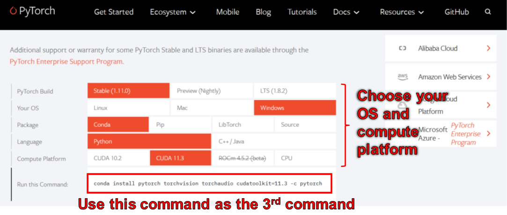
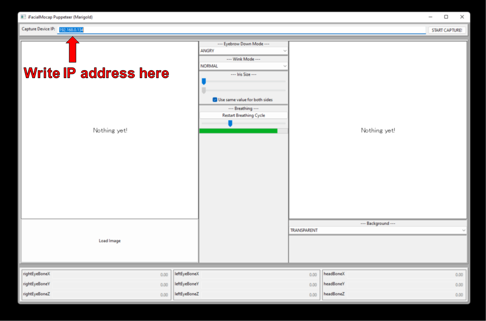
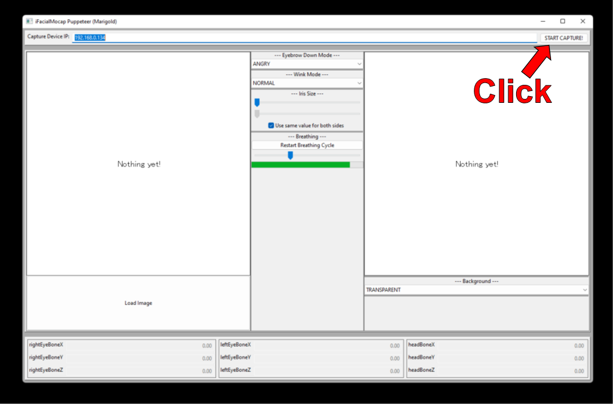
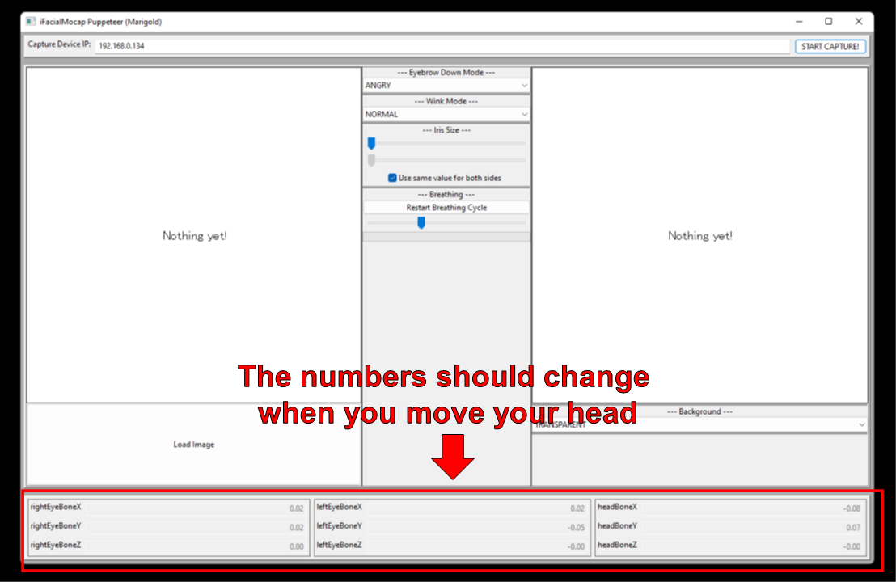
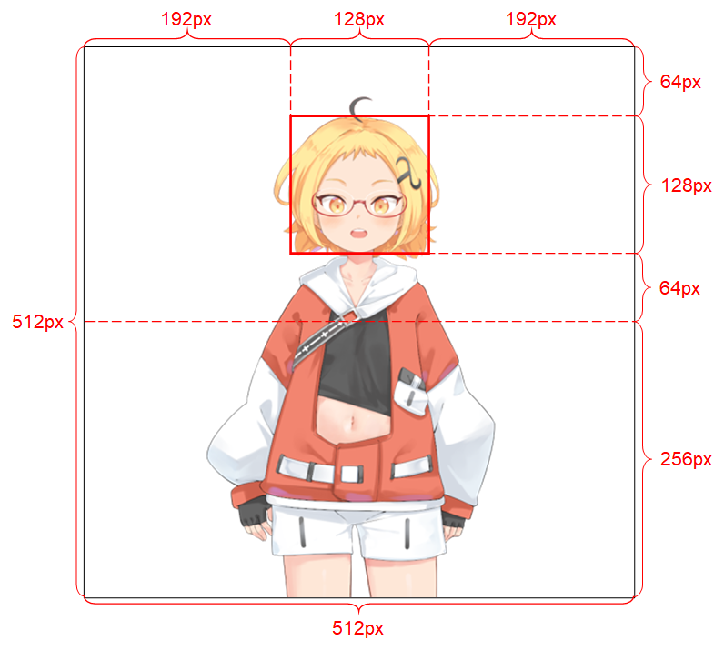

# Demo Code for "Talking Head(?) Anime from A Single Image 3: Now the Body Too"

This repository contains demo programs for the [Talking Head(?) Anime from a Single Image 3: Now the Body Too](https://pkhungurn.github.io/talking-head-anime-3/index.html) project. As the name implies, the project allows you to animate anime characters, and you only need a single image of that character to do so. There are two demo programs:

* The ``manual_poser`` lets you manipulate a character's facial expression, head rotation, body rotation, and chest expansion due to breathing through a graphical user interface. 
* ``ifacialmocap_puppeteer`` lets you transfer your facial motion to an anime character.

## Try the Manual Poser on Google Colab

If you do not have the required hardware (discussed below) or do not want to download the code and set up an environment to run it, click [](https://colab.research.google.com/github/pkhungurn/talking-head-anime-3-demo/blob/master/colab.ipynb) to try running the manual poser on [Google Colab](https://research.google.com/colaboratory/faq.html).

## Hardware Requirements

Both programs require a recent and powerful Nvidia GPU to run. I could personally ran them at good speed with the Nvidia Titan RTX. However, I think recent high-end gaming GPUs such as the RTX 2080, the RTX 3080, or better would do just as well.

The `ifacialmocap_puppeteer` requires an iOS device that is capable of computing [blend shape parameters](https://developer.apple.com/documentation/arkit/arfaceanchor/2928251-blendshapes) from a video feed. This means that the device must be able to run iOS 11.0 or higher and must have a TrueDepth front-facing camera. (See [this page](https://developer.apple.com/documentation/arkit/content_anchors/tracking_and_visualizing_faces) for more info.) In other words, if you have the iPhone X or something better, you should be all set. Personally, I have used an iPhone 12 mini.

## Software Requirements

### GPU Related Software

Please update your GPU's device driver and install the [CUDA Toolkit](https://developer.nvidia.com/cuda-toolkit) that is compatible with your GPU and is newer than the version you will be installing in the next subsection.

### Python Environment

Both ``manual_poser`` and ``ifacialmocap_puppeteer`` are available as desktop applications. To run them, you need to set up an environment for running programs written in the [Python](http://www.python.org) language. The environment needs to have the following software packages:

* Python >= 3.8
* PyTorch >= 1.11.0 with CUDA support
* SciPY >= 1.7.3
* wxPython >= 4.1.1
* Matplotlib >= 3.5.1

One way to do so is to install [Anaconda](https://www.anaconda.com/) and run the following commands in your shell:

```
> conda create -n talking-head-anime-3-demo python=3.8
> conda activate talking-head-anime-3-demo
> conda install pytorch torchvision torchaudio cudatoolkit=11.3 -c pytorch
> conda install scipy
> pip install wxpython
> conda install matplotlib
```

#### Caveat 1: Do not use Python 3.10 on Windows

As of June 2006, you cannot use [wxPython](https://www.wxpython.org/) with Python 3.10 on Windows. As a result, do not use Python 3.10 until [this bug](https://github.com/wxWidgets/Phoenix/issues/2024) is fixed. This means you should not set ``python=3.10`` in the first ``conda`` command in the listing above.

#### Caveat 2: Adjust versions of Python and CUDA Toolkit as needed

The environment created by the commands above gives you Python version 3.8 and an installation of [PyTorch](http://pytorch.org) that was compiled with CUDA Toolkit version 11.3. This particular setup might not work in the future because you may find that this particular PyTorch package does not work with your new computer. The solution is to:

1. Change the Python version in the first command to a recent one that works for your OS. (That is, do not use 3.10 if you are using Windows.)
2. Change the version of CUDA toolkit in the third command to one that the PyTorch's website says is available. In particular, scroll to the "Install PyTorch" section and use the chooser there to pick the right command for your computer. Use that command to install PyTorch instead of the third command above.



### Jupyter Environment

The ``manual_poser`` is also available as a [Jupyter Nootbook](http://jupyter.org). To run it on your local machines, you also need to install:

* Jupyter Notebook >= 7.3.4
* IPywidgets >= 7.7.0

In some case, you will also need to enable the ``widgetsnbextension`` as well. So, run

```
> jupyter nbextension enable --py widgetsnbextension
```

After installing the above two packages. Using Anaconda, I managed to do the above with the following commands:

```
> conda install -c conda-forge notebook
> conda install -c conda-forge ipywidgets
> jupyter nbextension enable --py widgetsnbextension
```

### Automatic Environment Construction with Anaconda

You can also use Anaconda to download and install all Python packages in one command. Open your shell, change the directory to where you clone the repository, and run:

```
> conda env create -f environment.yml
```

This will create an environment called ``talking-head-anime-3-demo`` containing all the required Python packages.

### iFacialMocap

If you want to use ``ifacialmocap_puppeteer``, you will also need to an iOS software called [iFacialMocap](https://www.ifacialmocap.com/) (a 980 yen purchase in the App Store). You do not need to download the paired application this time. Your iOS and your computer must use the same network. For example, you may connect them to the same wireless router.

## Download the Models

Before running the programs, you need to download the model files from this [Dropbox link](https://www.dropbox.com/s/y7b8jl4n2euv8xe/talking-head-anime-3-models.zip?dl=0) and unzip it to the ``data/models`` folder under the repository's root directory. In the end, the data folder should look like:

```
+ data
  + images
    - crypko_00.png
    - crypko_01.png
        :
    - crypko_07.png
    - lambda_00.png
    - lambda_01.png
  + models
    + separable_float
      - editor.pt
      - eyebrow_decomposer.pt
      - eyebrow_morphing_combiner.pt
      - face_morpher.pt
      - two_algo_face_body_rotator.pt
    + separable_half
      - editor.pt
          :
      - two_algo_face_body_rotator.pt
    + standard_float
      - editor.pt
          :
      - two_algo_face_body_rotator.pt
    + standard_half
      - editor.pt
          :
      - two_algo_face_body_rotator.pt
```

The model files are distributed with the 
[Creative Commons Attribution 4.0 International License](https://creativecommons.org/licenses/by/4.0/legalcode), which
means that you can use them for commercial purposes. However, if you distribute them, you must, among other things, say 
that I am the creator.

## Running the `manual_poser` Desktop Application

Open a shell. Change your working directory to the repository's root directory. Then, run:

```
> python tha3/app/manual_poser.py
```

Note that before running the command above, you might have to activate the Python environment that contains the required
packages. If you created an environment using Anaconda as was discussed above, you need to run

```
> conda activate talking-head-anime-3-demo
```

if you have not already activated the environment.

### Choosing System Variant to Use

As noted in the [project's write-up](http://pkhungurn.github.io/talking-head-anime-3/index.html), I created 4 variants of the neural network system. They are called ``standard_float``, ``separable_float``, ``standard_half``, and ``separable_half``. All of them have the same functionalities, but they differ in their sizes, RAM usage, speed, and accuracy. You can specify which variant that the ``manual_poser`` program uses through the ``--model`` command line option.

```
> python tha3/app/manual_poser --model <variant_name>
```

where ``<variant_name>`` must be one of the 4 names above. If no variant is specified, the ``standard_float`` variant (which is the largest, slowest, and most accurate) will be used.

## Running the `manual_poser` Jupyter Notebook

Open a shell. Activate the environment. Change your working directory to the repository's root directory. Then, run:

```
> jupyter notebook
```

A browser window should open. In it, open `manual_poser.ipynb`. Once you have done so, you should see that it has two cells. Run the two cells in order. Then, scroll down to the end of the document, and you'll see the GUI there.

You can choose the system variant to use by changing the ``MODEL_NAME`` variable in the first cell. If you do, you will need to rerun both cells in order for the variant to be loaded and the GUI to be properly updated to use it.

## Running the `ifacialmocap_poser`

First, run iFacialMocap on your iOS device. It should show you the device's IP address. Jot it down. Keep the app open.


Open a shell. Activate the Python environment. Change your working directory to the repository's root directory. Then, run:

```
> python tha3/app/ifacialmocap_puppeteer.py
```

You will see a text box with label "Capture Device IP." Write the iOS device's IP address that you jotted down there.



Click the "START CAPTURE!" button to the right.



If the programs are connected properly, you should see the numbers in the bottom part of the window change when you move your head.



Now, you can load an image of a character, and it should follow your facial movement.

## Contraints on Input Images

In order for the system to work well, the input image must obey the following constraints:

* It should be of resolution 512 x 512. (If the demo programs receives an input image of any other size, they will resize the image to this resolution and also output at this resolution.)
* It must have an alpha channel.
* It must contain only one humanoid character.
* The character should be standing upright and facing forward.
* The character's hands should be below and far from the head.
* The head of the character should roughly be contained in the 128 x 128 box in the middle of the top half of the image.
* The alpha channels of all pixels that do not belong to the character (i.e., background pixels) must be 0.



See the project's [write-up](http://pkhungurn.github.io/talking-head-anime-3/full.html#sec:problem-spec) for more details on the input image.

## Citation

If your academic work benefits from the code in this repository, please cite the project's web page as follows:

> Pramook Khungurn. **Talking Head(?) Anime from a Single Image 3: Now the Body Too.** http://pkhungurn.github.io/talking-head-anime-3/, 2022. Accessed: YYYY-MM-DD.

You can also used the following BibTex entry:

```
@misc{Khungurn:2022,
    author = {Pramook Khungurn},
    title = {Talking Head(?) Anime from a Single Image 3: Now the Body Too},
    howpublished = {\url{http://pkhungurn.github.io/talking-head-anime-3/}},
    year = 2022,
    note = {Accessed: YYYY-MM-DD},
}
```

## Disclaimer

While the author is an employee of [Google Japan](https://careers.google.com/locations/tokyo/), this software is not Google's product and is not supported by Google.

The copyright of this software belongs to me as I have requested it using the [IARC process](https://opensource.google/documentation/reference/releasing#iarc). However, Google might claim the rights to the intellectual
property of this invention.

The code is released under the [MIT license](https://github.com/pkhungurn/talking-head-anime-2-demo/blob/master/LICENSE).
The model is released under the [Creative Commons Attribution 4.0 International License](https://creativecommons.org/licenses/by/4.0/legalcode). Please see the README.md file in the ``data/images`` directory for the licenses for the images there.
